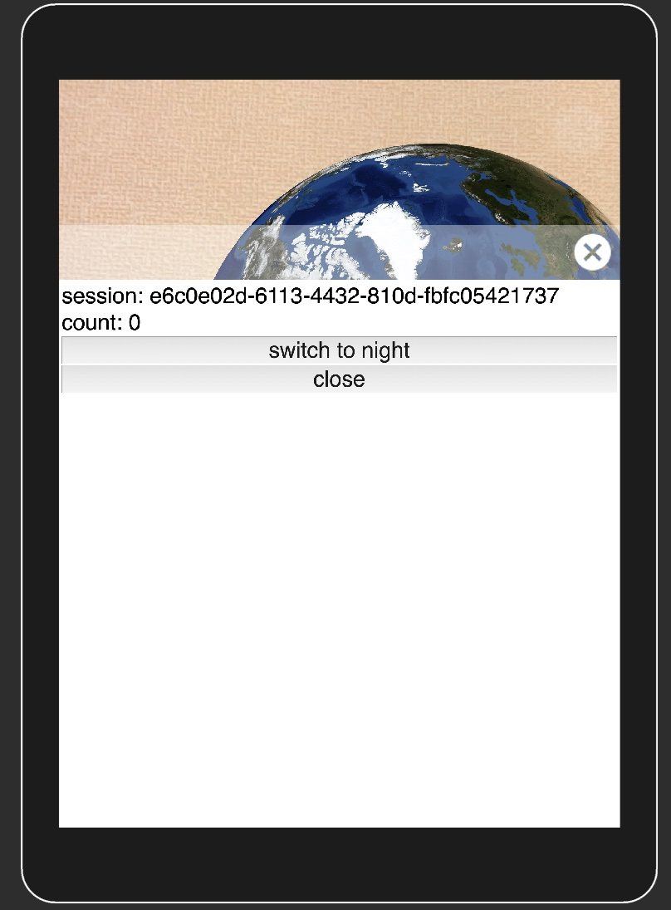

# API サーバ（アースボールに表示するコンテンツを配信）をメインで開発したい方へ

サーバサイドの実装だけで柔軟に情報提示ができる Unity のサンプルプロジェクトです。
アースボールに表示するコンテンツを JSON 形式で配信する HTTP API サーバをご用意いただくことで、
Unity 側のコードをほぼ書かずに、アースボール上にコンテンツを表示するデモアプリケーションを開発することができます。

## いちど動かしてみましょう

何はともあれ、一度サンプルプロジェクトを動かしてみましょう！

以下の手順を実行します：

1. このレポジトリの `ServerData` ディレクトリ以下のコンテンツを配信する HTTP サーバを起動してください（npm の `http-server` パッケージ（ https://www.npmjs.com/package/http-server ）や、Python の `http.server` モジュール (https://docs.python.org/ja/3/library/http.server.html) が便利です）

2. サンプルプロジェクトの `Hackathon/Packages/` 配下に `com.ptc.vuforia.engine-10.14.4.tgz` ファイルを配置します。このファイルは[Vuforia の developer portal サイト](https://developer.vuforia.com/downloads/sdk)からダウンロードできる、Vuforia Engine（バージョン 10.14）の unitypackage に含まれています。新規 Unity プロジェクトにドロップしてインポートし、tgz ファイルを取り出すのが最も簡単です

3. Unity (2021.3.19 以上のバージョンをお使いください) で、このレポジトリの `Hackathon` ディレクトリを開きます

4. Hierarchy から、`App/Scenes/App.scene` を開きます

5. Window > Vuforia Configuration を開き、"App License Key" というフィールドに、事前に発行していただいた Vuforia の Basic plan のライセンスキーを入力します


6. File > Build Settings... を開き、Android か iOS を選んで Switch Platform をします。

7. `▷` ボタンを押します。

PC のカメラの映像が表示され、左下に「vuforia」という透かしが表示されます。

もし、画面表示が横長だったら、縦長になるよう Game View のアスペクト設定を変更してください。Display 1という表示の右隣がアスペクト設定です。アスペクト比が縦長でないと WebView の閉じるボタンが表示されません。

カメラに「ほぼ日のアースボール」を映したとき、以下のように地球上に恐竜が表示されたら、正常な動作です！


地球をタップすると、地球のテクスチャが切り替わります。
また、恐竜をタップすると、Web ブラウザが起動し、その恐竜についてのページを開きます。

## 恐竜を表示したりする仕組み

ところで、サンプルプロジェクトの恐竜や地球は、実は以下のような JSON オブジェクトで定義されています：

```
[
  {
    "id": "Globe",
    "overwrite": "true",
    "model": "Sphere",
    "material": "Unlit",
    "texture": "globe_texture.jpg",
    "location": "0, 0, 0",
    "direction": "0, 0, 0",
    "scale": "1, 1, 1",
    "actions": [
      {"action": "add", "param": "globe_texture_alter.json"},
      {"action": "delete", "param": "Washington,Fukui"}
    ]
  },
  {
    "id": "Washington",
    "model": "PlaneB",
    "material": "UnlitTransparentNoCull",
    "texture": "Tyrannosaurus.png",
    "location": "-77.01587, 38.895450, 1",
    "direction": "-90, 0, 0",
    "scale": "0.4",
    "actions": [
      {"action": "open", "param": "https://ja.wikipedia.org/wiki/%E3%83%86%E3%82%A3%E3%83%A9%E3%83%8E%E3%82%B5%E3%82%A6%E3%83%AB%E3%82%B9"}
    ]
  },
  {
    "id": "Fukui",
    "model": "PlaneB",
    "material": "UnlitTransparentNoCull",
    "texture": "dinosaur_fukuivenator_paradoxus.png",
    "location": "136.5703513229182, 36.128513093323214, 1",
    "direction": "-90, 0, 0",
    "scale": "0.4",
    "actions": [
      {"action": "open", "param": "https://ja.wikipedia.org/wiki/%E3%83%95%E3%82%AF%E3%82%A4%E3%83%99%E3%83%8A%E3%83%BC%E3%83%88%E3%83%AB"}
    ]
  }
]
```

今回のサンプルプロジェクトでは、このような JSON オブジェクト（を配信する HTTP サーバ）さえ用意すれば、
アースボール上にあらゆるオブジェクトを表示することができてしまいます。

## API サーバで返却する JSON オブジェクトのスキーマ

それでは、どのような JSON オブジェクトを配信すればよいのか、
仕様を掘り下げていきます。

### `id` プロパティ

`id` プロパティは、 `String` 型の値です。Unity 側では、こちらの値によってアースボール上に表示するオブジェクトを識別します。（ですので、他の object と値が重複しないようにしてください）

### `model` プロパティ

`model` プロパティは、`String` 型の値です。表示するオブジェクトの形状をここで指定します。
取りうる値は決まっていて、以下のいずれかです：

- `Line`
- `PlaneB`
- `PlaneC`
- `Sphere`
- `Label`

これらの値と同じ名前の Prefab Asset が、サンプルプロジェクトの `Assets/App/Resources` 以下に配置されています。

Unity 上で当該フォルダを閲覧すると、以下のように確認することができます。


こちらのスクリーンショットからも直感的にわかるかもしれませんが、
`Line` は線、`Plane` は平面、`Sphere` は球体の形状の model です。

例えば、アースボールアプリで地球上に好きな画像を表示したい場合には、
地球のモデルには `Sphere` を、画像のモデルには `Plane` を指定します。
`Plane` には、`PlaneB` (B は Bottom) と `PlaneC` (C は Center) の二種類がありますが、
違いはオブジェクトが配置される仕組みのみです。

`PlaneB` は、オブジェクトの真下が座標となり、`PlaneC` はオブジェクトの中心が座標となります。
例えば、地球上のどこかの場所にピンを立てる場合、ピンのオブジェクトには `PlaneB` を使うと良さそうです。
一方で、地球に接するように画像を表示したい場合（つまり、地球の接平面として画像を表示したい場合。あまり良い例が思いつきませんが…）、`PlaneC` を使うと良さそうです。

`Label` は、他のオブジェクトのラベルとして使われることを想定された（例えば、恐竜のオブジェクトの上に「トリケラトプス」と表示する）、テキストのオブジェクトです。

model プロパティに値 `"Label"` を指定した場合、プロパティ `label` に、表示したいテキストの内容を指定することができます。

以下は恐竜のオブジェクトのラベルを定義する JSON のサンプルです：

```json
{
  "id": "FukuiLabel",
  "model": "Label",
  "label": "Fukuivenator",
  "location": "136.5703513229182, 36.128513093323214, 1.4",
  "direction": "-90, 0, 0",
  "scale": "0.4",
  "actions": [
    {
      "action": "open",
      "param": "https://ja.wikipedia.org/wiki/%E3%83%95%E3%82%AF%E3%82%A4%E3%83%99%E3%83%8A%E3%83%BC%E3%83%88%E3%83%AB"
    }
  ]
}
```

※ Label モデルで日本語を利用したい場合、サンプルプロジェクトでは英語フォントにしか対応していないため、日本語フォントを別途組み込む必要があります（フォントのライセンスにご注意ください）。

Label モデルは内部で TextMesh Pro という機能を使っており、TextMesh Pro で所望のフォントの "Font Asset" を作成する必要があります。

参考（外部の方のブログエントリです）：【Unity】TextMesh Pro でダイナミックフォントを使用する一番簡単でハマらない手順（Font Asset Creator を使わない） - LIGHT11
https://light11.hatenadiary.com/entry/2022/05/23/195156

### `material` プロパティ

`material` プロパティでは、オブジェクトのマテリアルを設定することができます。
マテリアルは、オブジェクトに色や模様をつけたり、表面の質感を変えたりするものです。
サンプルプロジェクトでは、以下の５種類のマテリアルをサポートしています。
デフォルトでは、`UnlitTransparent` という値が使われます。

- `Standard`
- `Unlit`
- `UnlitNoCull`
- `UnlitTransparent`
- `UnlitTransparentNoCull`

それぞれのマテリアルを比較した表が以下です：

|                        | ライティングを考慮する(Lit) | 見えている面だけを描画する(Cull) | 表面の透過(transparent) | オブジェクトの例                           |
| ---------------------- | --------------------------- | -------------------------------- | ----------------------- | ------------------------------------------ |
| Standard               | ◯                           | ✗                                | ✗                       | 鉄球（テクスチャを設定しない球体）         |
| Unlit                  | ✗                           | ◯                                | ✗                       | 地球（上からテクスチャを貼ってしまう球体） |
| UnlitNoCull            | ✗                           | ✗                                | ✗                       | 四角形など、単純な 2D の図形               |
| UnlitTransparent       | ✗                           | ◯                                | ◯                       |                                            |
| UnlitTransparentNoCull | ✗                           | ✗                                | ◯                       | 地球上にピンを立てるときの画像オブジェクト |

### `texture` プロパティ

`texture` プロパティでは、オブジェクトの表面に貼り付ける画像を URL で指定します。初期 URL からの相対 URL 表記に対応しています。

例えば、アースボールのテクスチャはこちらです：


値には、テクスチャ画像の URL を指定します。

サンプルとして`ServerData`には

- globe_texture
- globe_night
- globe_texture_white

が用意されています。

### `location` プロパティ

`location` プロパティでは、オブジェクトを配置する（地球上の）位置を指定します。
例えば、以下は日本の福井県のあたりにオブジェクトを配置する際の例です：

```json
"location": "136.5703513229182, 36.128513093323214, 1",
```

左から、`<経度>, <緯度>, <高さ>` の値を指定しています。
`<高さ>` の値について、単位はメートルなどではないことに注意してください。
ここで指定するのは、「地球の半径を 1 としたときの高さ」です。
したがって、`1` を指定すると、地球のちょうど表面上にオブジェクトが配置されます。
（地球上にピンを立てるなど、大抵の場合は、`1` を指定しておけば良さそうです。）

### `direction` プロパティ

`direction` プロパティでは、オブジェクトの向きを指定します。
例えば、以下は地球にピンを立てる際の例です：

```json
"rotation": "-90, 0, 0",
```

左から、「x 軸, y 軸, z 軸 を中心に、何度回転させるか」を指定しています。
値が正であれば左回りに回転し、負であれば右回りに回転します。
今回の例では、「x 軸を中心に、右回りに 90° 回転させる」ことになります。


ちなみに、`0, 0, 0` を指定すると、地球の表面にピタリと貼り付くような姿勢になります。

### `scale` プロパティ

`scale` プロパティでは、オブジェクトの拡大・縮小をさせることができます。
このプロパティのデフォルト値は `"1"` で、この場合オブジェクトの拡大・縮小は行われません。
もし、表示させてみたオブジェクトが思ったより大きかった・小さかった場合には、
`scale` の値を調整することで、テクスチャ等を作り直すことなく、大きさを調整することができます。

### `actions` プロパティ

`actions` プロパティでは、オブジェクトがクリック（タップ）されたとき、
「新しいオブジェクトを追加する」「ブラウザで特定のページを開く」などのアクションを定義することができます。
サポートされているアクションは、`load`, `add`, `delete`, `open`, `close`, `update` の６種類です。

- `load`: オブジェクトを一度全て消去してから JSON ファイルを読み込み直します。`"param": "http://localhost:8080/objects.json"` のようにして、追加する JSON ファイルの URL を指定します。初期 URL からの相対 URL 表記に対応しています。
- `add`: JSON ファイルを読み込み、新しいオブジェクトとして追加します。`"param": "http://localhost:8080/new_objects.json"` のようにして、追加する JSON ファイルの URL を指定します。初期 URL からの相対 URL 表記に対応しています。
- `delete`: オブジェクトを削除します。`"param": "Fukui"` のようにして、削除するオブジェクトの id を指定します。カンマ区切りで複数の id を指定できます
- `open`: ブラウザで、特定の URL のページを開きます。URL は、`"param": "https://ja.wikipedia.org/wiki/%E3%83%95%E3%82%AF%E3%82%A4%E3%83%99%E3%83%8A%E3%83%BC%E3%83%88%E3%83%AB"` のように指定します。初期 URL からの相対 URL 表記に対応しています。
- `close`: ブラウザが開いていた場合、閉じます
- `update`: 後述するユーザー状態を `param` で更新します

例えば、以下の JSON は、「福井県に恐竜の画像を配置する」という内容のオブジェクトですが、
`actions` プロパティに、`[{ "action": "open", "param": "https://ja.wikipedia.org/wiki/%E3%83%95%E3%82%AF%E3%82%A4%E3%83%99%E3%83%8A%E3%83%BC%E3%83%88%E3%83%AB" }]` という値を指定することで、
オブジェクトをタップしたときに、URL で指定したサイト（ Wikipedia の恐竜のページ）を、Web ブラウザで開くようになります。

```json
{
  "id": "Fukui",
  "model": "PlaneB",
  "material": "UnlitTransparentNoCull",
  "texture": "dinosaur_fukuivenator_paradoxus.png",
  "location": "136.5703513229182, 36.128513093323214, 1",
  "direction": "-90, 0, 0",
  "scale": "0.4",
  "actions": [
    {
      "action": "open",
      "param": "https://ja.wikipedia.org/wiki/%E3%83%95%E3%82%AF%E3%82%A4%E3%83%99%E3%83%8A%E3%83%BC%E3%83%88%E3%83%AB"
    }
  ]
}
```

また、`actions` には、複数のアクションを指定することができます。
`[{ "action": "add", "param": "globe_texture_alter.json" },{ "action": "delete", "param": "Washington,Fukui" }]` のようにして、配列に複数のアクションを含めることができます。

例として、以下の JSON では、地球本体のオブジェクトを定義していますが、
`actions` プロパティにて、「新しいオブジェクト（`globe_texture_alter.json`）を追加し、特定のオブジェクト（`Washington,Fukui`）を削除する」という一連のアクションを定義しています。

```json
{
  "id": "Globe",
  "overwrite": "true",
  "model": "Sphere",
  "material": "Unlit",
  "texture": "globe_texture.jpg",
  "location": "0, 0, 0",
  "direction": "0, 0, 0",
  "scale": "1, 1, 1",
  "actions": [
    { "action": "add", "param": "globe_texture_alter.json" },
    { "action": "delete", "param": "Washington,Fukui" }
  ]
}
```

ちなみに、２つ目のアクション： `add` で指定している URL の JSON の内容は以下の通りです：

```json
[
  {
    "id": "Globe",
    "overwrite": "true",
    "model": "Sphere",
    "material": "Unlit",
    "texture": "globe_night.jpg",
    "location": "0, 0, 0",
    "direction": "0, 0, 0",
    "scale": "1, 1, 1",
    "actions": [{ "action": "add", "param": "objects.json" }]
  }
]
```

このオブジェクトもやはり地球のオブジェクトであり、テクスチャだけが違っています。
また、`"overwrite"` というプロパティが指定されています。`"overwrite": "true"` を指定すると、もしすでに同じ id のオブジェクトが存在していた場合に、そのオブジェクトを削除して、新しいオブジェクトで置き換えます。
したがって、「地球をタップすると、その地球が作り直されて、新しい夜の地球になる」というインタラクションになります。


## WebView を用いて高度な処理を行う例

以前のセクションでは、静的な HTTP ファイルサーバを用意し、オブジェクトを表示するための JSON ファイルを配信しました。

では、サーバ側でユーザのセッションを管理し、Unity からサーバにリクエストするたびに、サーバ側では動的にレスポンスを生成する例も見ていきましょう。

例によって、サンプルプロジェクトを用意しております。以下の手順で試すことができます：

1. Python3 をインストール
2. pip で `flask` パッケージをインストール（`pip3 install flask`）
3. shell で `ServerData` ディレクトリ配下に移動し、`python3 server.py` を実行
4. 3 で HTTP サーバが起動し、標準出力にサーバの URL が出力されるので、その URL を Unity の Hierarchy （画面左のペイン） > Controller > Controller (Script) （画面右のペイン）> Initial URL に入力

Unity でシーンを再生し、地球のオブジェクトをタップすると、以下のような WebView が表示されます：



`switch to night` もしくは `close` をタップすると、モーダルが閉じます。ふたたび地球のオブジェクトをタップすると、モーダルが再度開くのですが、`count: ` の値がインクリメントされていることがわかります。

### ユーザー状態について

サーバサイドがユーザーごとの状態を管理できるように、`load` や `add` そして `open` のリクエスト時に `X-User-State` というリクエストヘッダでユーザー状態文字列が送信されます。

ユーザー状態文字列は、初期のオブジェクト一覧のロード時、あるいは `load` か `add` の action 実行時に、レスポンスヘッダの `X-User-State` に値を設定することで更新されます。あるいは、`update` action でも更新することができます。

ユーザー状態文字列は、クライアントサイドでは解釈されませんので、サーバサイドの都合で自由な文字列を設定可能ですが、HTTP のヘッダで送受信されるため、Web サーバごとの最大長制限があります。8kBを超える場合は、別の実装を検討してください。

なお、技術的制約により、`open` で開いた Web ページのレスポンスヘッダの `X-User-State` に値を設定してもユーザー状態は更新されません。代わりに後述する JavaScript 関数 `SendGlobeCommand()` の `update` action を使用してください。

### JavaScript 関数 `SendGlobeCommand()`

WebView から AR 表示をコントロールする方法として、JavaScript 関数 `SendGlobeCommand` が用意されています。JSON の actions と同じ形式で action のリストを渡すと実行します。

### サンプルの動作の詳細

`count` の値は、`session` ごとにサーバサイドでインクリメントされています。Unity とサーバとのインタラクションは以下のようになっています：

1. 地球のオブジェクトをタップ時、`actions` に `{ "action": "open", "param": "view_sample" }` が定義されているため、 `GET /view_sample` を HTTP リクエストする
2. サーバサイドでは、`/view_sample` のリクエストをハンドルする際、HTTP リクエストの `X-User-State` ヘッダを参照し、session id と 現在のカウントの値を取得する（セッションごとのカウントの値は、サーバサイドで保存することももちろん可能ですが、ステートレス化の例として、こうしています）
3. 2 で取得したカウントをインクリメントし、その値を HTML テンプレートに埋め込んで、HTTP レスポンスを生成する
4. WebView で表示する HTML の中の JavaScript コードで、 `SendGlobeCommand({"action": "update", "param": <カウンタを更新した新しいユーザー状態>);` を呼び出し、クライアントが保持するユーザー状態を更新する

サーバサイドの実装は、`ServerData/server.py` の内容を参考にしてください。

サーバ側でセッションを管理し、動的にレスポンスを生成することで、例えば他にも以下のようなインタラクションが可能となります：

- WebView のテキストフィールドに入力された文字を、サーバサイドで画像としてレンダリングし、その画像をテクスチャとしたオブジェクトをアプリ側で表示する
- 「旅行で実際に訪れた場所」にオブジェクトを表示する。オブジェクトをタップすると、その場所で撮影した写真が WebView で表示される。WebView を閉じると、旅行で次に訪れた場所にオブジェクトが表示される
