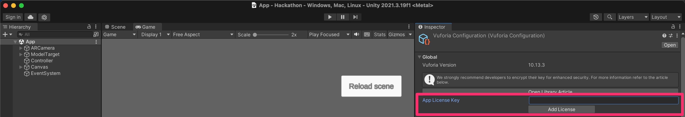

# サンプルの Unity プロジェクトを拡張していく形で開発したい方

## サンプルプロジェクトを起動する準備

何はともあれ、一度サンプルプロジェクトを動かしてみましょう！

以下の手順を実行します：

1. サンプルプロジェクトの `Hackathon/Packages/` 配下に `com.ptc.vuforia.engine-10.14.4.tgz` ファイルを配置します。このファイルは[Vuforia の developer portal サイト](https://developer.vuforia.com/downloads/sdk)からダウンロードできる、Vuforia Engine（バージョン 10.14）の unitypackage に含まれています。新規 Unity プロジェクトにドロップしてインポートし、tgz ファイルを取り出すのが最も簡単です

2. Unity (2021.3.19 以上のバージョンをお使いください) で、このレポジトリの `Hackathon` ディレクトリを開きます

3. Hierarchy から、`Assets/UnityNativeSample/Scenes/UnityNativeSample.unity` を開きます

4. Window > Vuforia Configuration を開き、"App License Key" というフィールドに、事前に発行していただいた Vuforia の Basic plan のライセンスキーを入力します

5. `▷` ボタンを押します

PC のカメラの映像が表示され、左下に「vuforia」という透かしが表示されます。

カメラに「ほぼ日のアースボール」を映したとき、以下のように地球上に恐竜が表示されたら、正常な動作です！

## サンプルプロジェクトの概要

- アースボール 2nd を認識すると 3D の地球をかぶせて表示
- 板ポリゴンの恐竜が地球上の 2 カ所に、それぞれ地面に垂直に立つ
- 2 つの恐竜の間に最短距離（大圏航路）の線を引く
- 線の中間に、実際の地球上での距離を表示
- 地球上をタップ・ドラッグすると恐竜の片方を移動し、線と距離が更新される
- もう一方の恐竜をタップすると、以降それが移動する恐竜になる

## 開発する上で便利なオブジェクト

### ModelTarget

- この下に置いた Renderer/Collider/Canvas は、アースボールの認識状態にあわせて自動的に ON/OFF される
  - それ以外のオブジェクトは触らないので、必要であれば ModelTarget の認識・未認識イベントをハンドルする
  - デフォルトでは空間認識（SLAM）が有効になっているため、アースボールの認識が外れてもオブジェクトの表示がしばらく残ることがある
- この下に置いた位置 0, 0, 0、向き identity、半径 1 の球体がアースボールの位置・向き・大きさに一致する

### ObjectOnSphere

- 球面座標系を使ってオブジェクトを設置できる
  - location.xyz はそれぞれ経度・緯度・高度を示す
    - 高度=1 のとき地球表面になる
    - 経度は+が東経 / -が西経
    - 緯度は+が北緯 / -が南緯
  - direction.xyz は 0, 0, 0 のとき、y 軸が地球表面の法線、z 軸が北になる
- ExecuteAlways が付いているため、Unity エディタ上で位置・向きを確認可能

### SphericalGeometry

- 球面幾何学に関連するいくつかの関数を提供する
  - 球面座標・直交座標の相互変換
  - 大圏航路の算出
  - 球面上の 2 点間の距離・向きの算出
